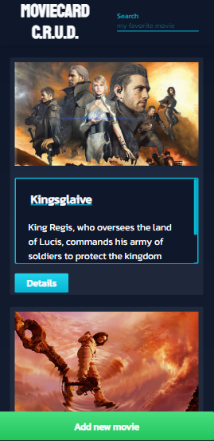

# Movie Card Library

Movie Card Library é uma aplicação web que te permite adicionar, atualizar e remover novos cards de filmes a aplicação

---

## Projeto proposto pela Trybe

Este foi um dos primeiros projetos do módulo de front-end proposto pela Trybe.Foi proposto que fizessemos um CRUD na aplicação (CREATE, READ, UPDATE, DELETE), e fizessemos uma simulação de consumo de API. 

---

## Mão na massa

<del>Como dito antes este foi um dos primeiros projetos do módulo de front-end por isso nele foi usando class component e não foi utilizado nem um gerenciador de estado como Context API ou Redux, optei por utilizar o react-bootstrap para estilizar o projeto que é um framework que disponibiliza componentes já estilizados e responsivos.</del>

### Atualização

Pensando em atualizar o projeto, recriei o projeto do zero ao invés de utilizar o create-react-app fiz uso do <a href="https://vitejs.dev/" target="_blank">vite</a>, com a nova versão do react(18), foi instalado também a nova versão do <a href="https://reactrouter.com/docs/en/v6/getting-started/overview" target="_blank">react router</a> e por conta dos seus hooks preferi fazer a transição de componentes de classe para componentes funcionais.

Além dessas atualizações adicionei type-script no projeto para que eu pudesse exercítar, já que não faço uso diário da tecnologia na empresa que estou atuando, alterei toda a estilização para fazer uso do tailwind a qual nunca tinha utilizado, mas o ponto principal são as implementações de testes, que não desenvolvia a um certo tempo, e pela primeira vez estou desenvolvendo com type-script.

---

## Próximos passos

Pretendo finalizar os testes, consumir de uma API ao invés de utilizar informações mockadas, adicionar o redux para gerênciar um estado global.