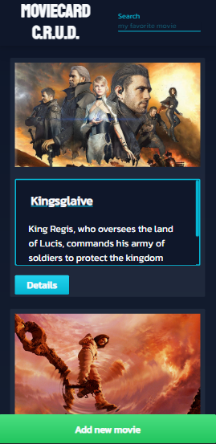

# Movie Card Library

### Acesso

***Para utilizar o app acesse: https://moviecardlibrary.netlify.app***

Movie Card Library é uma aplicação web que te permite adicionar, atualizar e remover novos cards de filmes a aplicação

---

## Projeto proposto pela Trybe

Este foi um dos primeiros projetos do módulo de front-end proposto pela Trybe.Foi proposto que fizessemos um CRUD na aplicação (CREATE, READ, UPDATE, DELETE), e fizessemos uma simulação de consumo de API. 

---

## Mão na massa

Como dito antes este foi um dos primeiros projetos do módulo de front-end por isso nele foi usando class component e não foi utilizado nem um gerenciador de estado como Context API ou Redux, optei por utilizar o react-bootstrap para estilizar o projeto que é um framework que disponibiliza componentes já estilizados e responsivos.

---